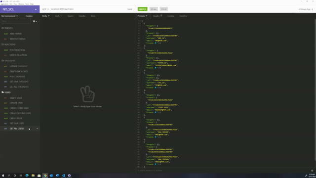

# Project Title : NoteTaker
## Project Description:
`The NoSQL project serves as a backend to a social media application. This project utilizes a database known as MONGODB. MondgoDB allows the developer to create a database without the use of mySQL or sequilize. This application allows the user to POST, DELETE, PUT & GET Users and Thoughts. It also allows the user to POST & DELET Reactions and Friends.`
## Table of Contents
* [Installation](#installation)
* [Usage](#usage)
* [Contributing](#contributing)
* [Test](#test)
* [Questions](#questions)
* [Author] (#Author)
## Installation
If one wishes to use this application or code. He/she must clone the repository and run npm i in the terminal to download the needed extensions.
## Usage

## Contributors
Jcsanchez
## If you wish to contribute
Not at this time
## Questions
If you have any questions, contact J-Sanchez on GitHub.
## Test
N/A
### Contact Me
jonathan.sanchez@windstream.net
### Link to Github
https://github.com/J-sanchez